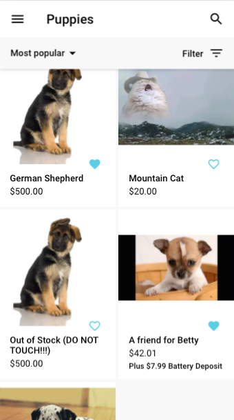
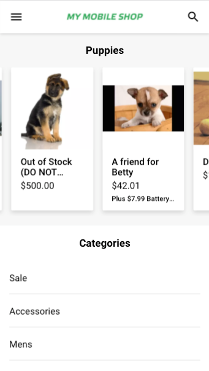
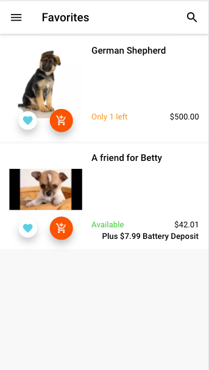
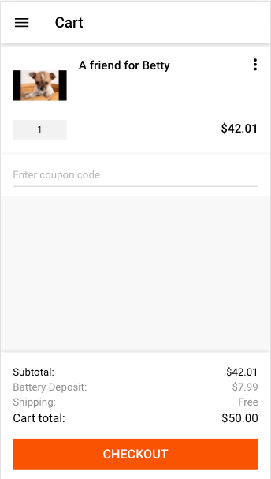
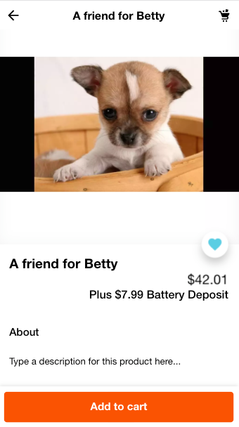
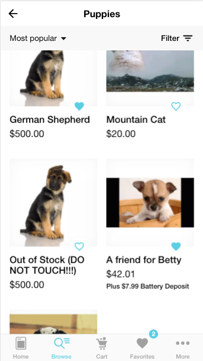
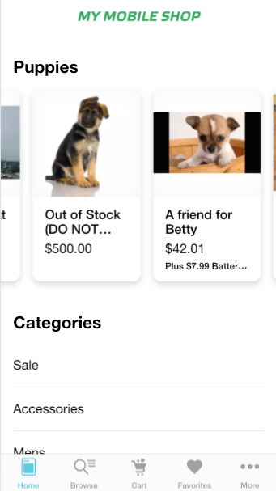
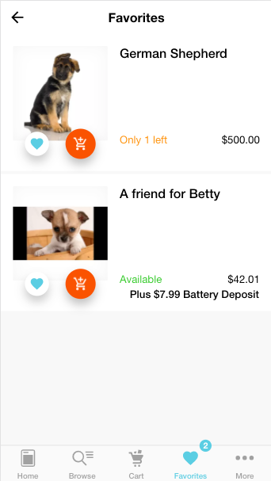
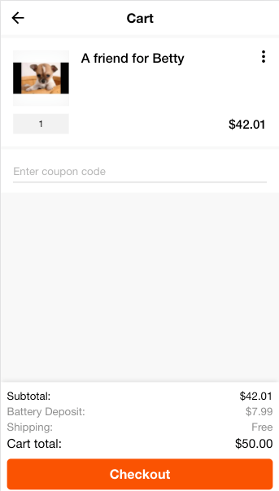

# Demo

## Separate Deposit Fee from Product Price
The Separate Deposit Fee from Product Price configuration is set up in the connect admin. All configurations are required Example configuration for the following images: 

#### Merchant Admin Config:
```json
{
  "triggerProductProperties": [{"label": "battery_deposit", "value": "yes", "depositAmount": 7.99}],
  "depositLabels": {
    "label": "Plus {deposit} battery deposit",
    "cartLabel": "Battery deposit"
  }
}
```

#### GMD Examples:






#### iOS Examples:





